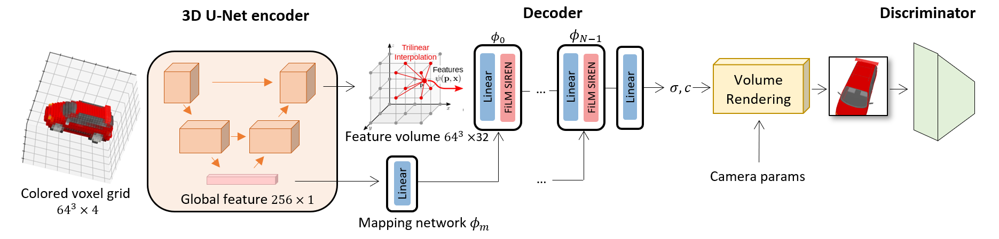
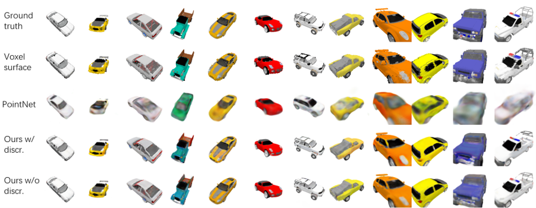
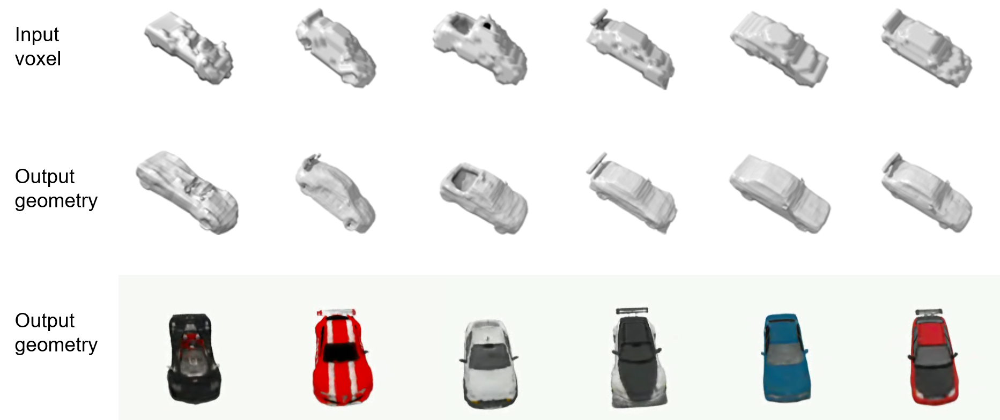
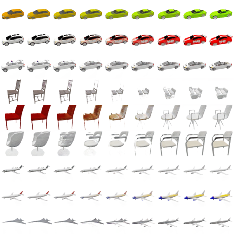

# Adversarial 3D Reconstruction with Neural Fields

This repo contains the implementation of my master thesis. We tried to improve the visual fidelity of 3D reconstruction results with GAN, hence the name "adversarial shape reconstruction”. Check out the [presentation slides](materials/presentation.pdf) or the [thesis](materials/thesis.pdf) for details.

# Abstract

3D reconstruction is a central topic in computer vision. Existing methods mostly focus on reconstruction accuracy and speed. However, many reconstruction results, though accurate, do not appear of high visual fidelity and realistic to human perception. This is because humans are not sensitive to geometric accuracy but can easily distinguish between a real scene and a reconstructed 3D scene. Meanwhile, most 3D generation methods can generate photo-realistic images but are not conditioned on existing objects.

We aim to leverage 3D generation to make 3D reconstruction results appear more photo-realistic to human perception. Toward this goal, we propose a conditional neural radiance field with a 3D U-Net encoder and a progressive discriminator supervised by images with known poses. We condition the neural radiance field with a global feature vector and a feature volume that encodes local information. The neural field’s input points are interpolated within the feature volume and are further transformed to color and density for volume rendering, producing images to be discriminated against real images.

We evaluate the proposed method with perceptual similarity metrics such as FID, LPIPS, etc. Our method can refine the input geometry of unseen objects of a known category, thus showing its generalization capacity. The results validate our approach and show that our method can render images of higher visual fidelity than those directly rendered from the input geometry. Since we adopt a GAN framework, our method can also interpolate in the latent space.

# Overview



# Experiments

Last two rows show rendering results of our method:


Our method produces much smoother results than the input geometry:


In the following video, the first, third, fifth rows show images rendered from input geometry; the second, fourth, sixth rows show rendered images of better visual quality from our method.


Our method is also capable of interpolation in the latent space.



# Usage

## Virtual environment setup

```
conda create --name VIRTENV python=3.9
conda activate VIRTENV
conda install pytorch torchvision torchaudio cudatoolkit=11.3 -c pytorch
pip install -r requirements.txt
```

## Create data folder

`./prepare_data.sh`

Then, update the `"dataset":"path"` field in `configs/special.py` to point to your `./data/ShapeNetCar` directory.

## Test if settings are installed correct

`python train.py -o test -p 1`

## Hyperparameters

- [Default hyperparameters](configs/thousand/default.py): default.py
- [Frequently changed hyperparameters](configs/thousand/special.py): special.py
- [What does each hyperparameter mean?](configs/curriculums.py)

The final hyperparameters will be default hyperparameters in `configs/thousand/default.py` overloaded by `configs/thousand/special.py` and then overloaded by the parser.config (if --config is specified).

## Train

`python train.py -o OUTPUT_DIR -p PRINT_FREQUENCY -s SAMPLING_IMGS_FREQENCY`

## Inference

During training, the model will output rendered rgb and depth images of train/val/test set cars under the OUTPUT_DIR/samples/ directory. But you can also do inference on selected cars after the training is done:

### Rendering video

`python inference.py CKPT_DIR --sampling_mode SUBSET_OF_CARS_TO_INFERENCE --video`

### Rendering images

`python inference.py CKPT_DIR --sampling_mode SUBSET_OF_CARS_TO_INFERENCE --images`

## Show loss plot

`python misc/draw_loss.py PATH_EXP1 PATH_EXP2 ...`
