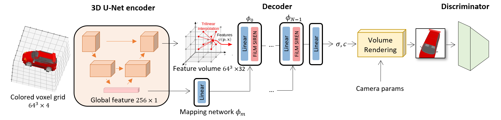
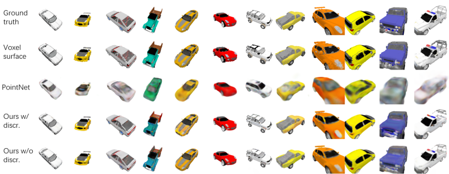
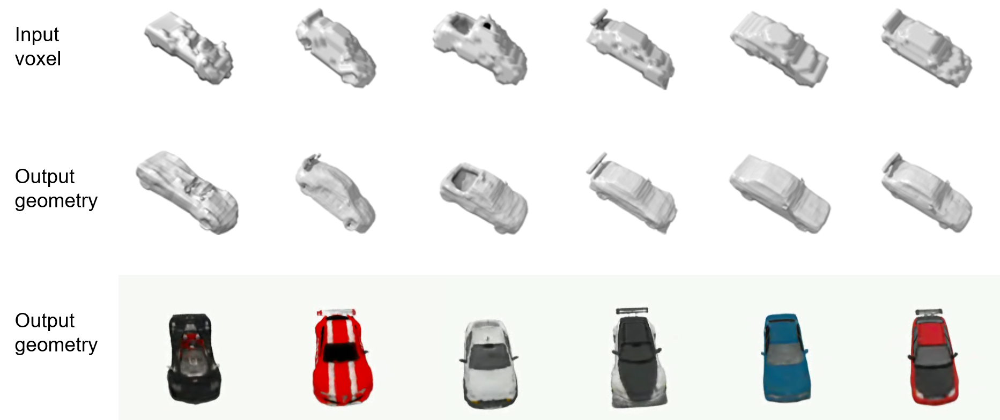
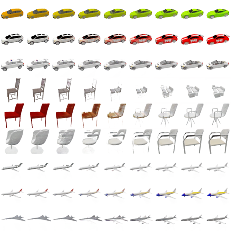

# Adversarial 3D Reconstruction with Neural Fields

This repo contains the implementation of my master thesis. We tried to improve the visual fidelity of 3D reconstruction results with GAN, hence the name "adversarial shape reconstruction”. Check out the [presentation slides](imgs/presentation.pdf) for details.

# Motivation

3D generation methods with GAN can generate photo-realistic images that are indistinguishable from real objects. But they are not conditioned on existing objects. 

In the meantime, 3D reconstruction can reconstruct existing objects with high geometric accuracy. But the results are often noisy and not photo-realistic to human perception. 

We want to have the best of both worlds, and to improve the visual fidelity of 3D reconstruction results (e.g point clouds or voxel grids) with an adversarial loss. We decide to use NeRF/Neural fields as the 3D representation model due to its ability to render photo-realistic images of high resolution.

# System overview


# Experiments
Last two rows show rendering results of our method:


Our method produces much smoother results than the input geometry:


In the following video, the first, third, fifth rows show images rendered from input geometry; the second, fourth, sixth rows show rendered images of better visual quality from our method. 


Our method is also capable of interpolation in the latent space.



# Usage
## Virtual environment setup
```
conda create --name VIRTENV python=3.9
conda activate VIRTENV
conda install pytorch torchvision torchaudio cudatoolkit=11.3 -c pytorch
pip install -r requirements.txt
```
## Create data folder
`./prepare_data.sh`

Then, update the `"dataset":"path"` field in `configs/special.py` to point to your `./data/ShapeNetCar` directory.

## Test if settings are installed correct
`python train.py -o test -p 1`

## Hyperparameters
- [Default hyperparameters](configs/thousand/default.py): default.py
- [Frequently changed hyperparameters](configs/thousand/special.py): special.py
- [What does each hyperparameter mean?](configs/curriculums.py)

The final hyperparameters will be default hyperparameters in `configs/thousand/default.py` overloaded by  `configs/thousand/special.py` and then overloaded by the parser.config (if --config is specified).

## Train

`python train.py -o OUTPUT_DIR -p PRINT_FREQUENCY -s SAMPLING_IMGS_FREQENCY`

## Inference
During training, the model will output rendered rgb and depth images of train/val/test set cars under the OUTPUT_DIR/samples/ directory. But you can also do inference on selected cars after the training is done:

### Rendering video
`python inference.py CKPT_DIR --sampling_mode SUBSET_OF_CARS_TO_INFERENCE --video`

### Rendering images
`python inference.py CKPT_DIR --sampling_mode SUBSET_OF_CARS_TO_INFERENCE --images`

## Show loss plot
`python misc/draw_loss.py PATH_EXP1 PATH_EXP2 ...`
